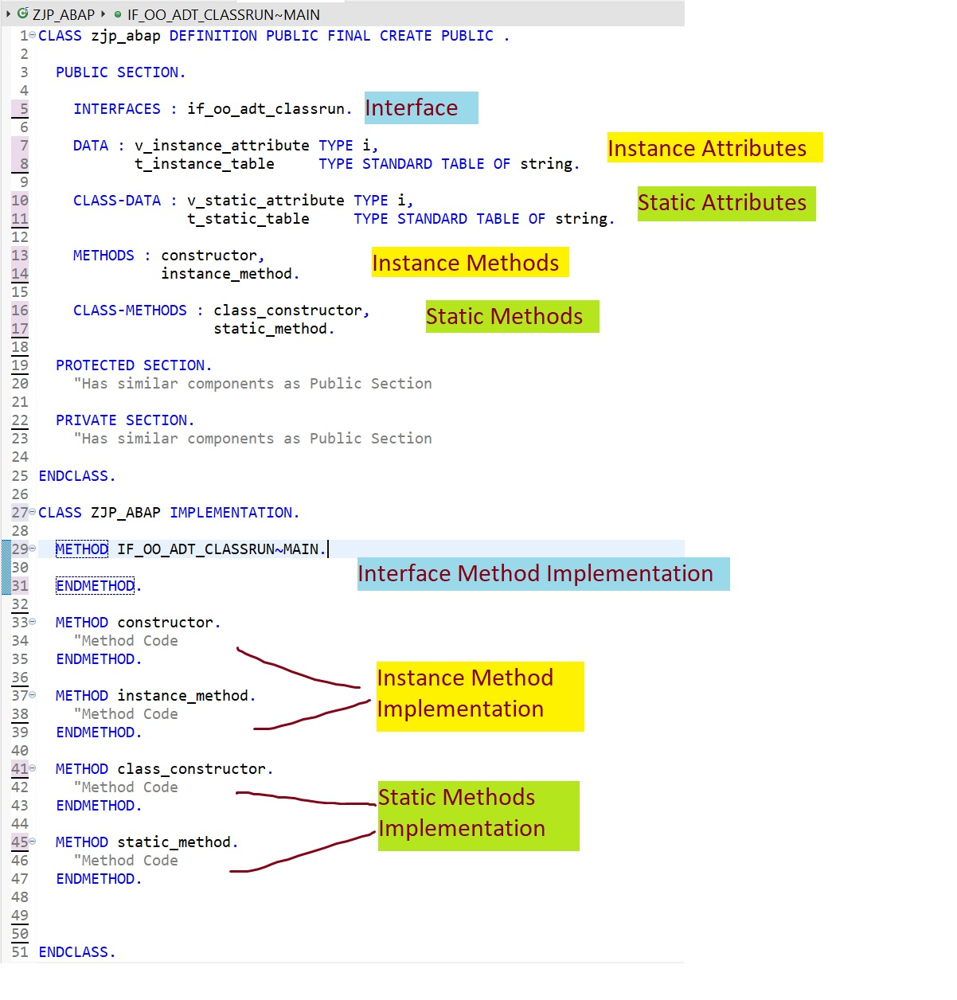

# Object Oriented ABAP (OO ABAP) 入门系列（一）：ABAP 类简介

> 介绍面向对象的 ABAP。如果您至今尚未开始使用 OO ABAP，本系列知识足以帮助您入门。
>
> 在本系列中，您将学习以下内容：
> - ABAP 类简介
> - 深入 ABAP 类

我们将使用 Eclipse IDE 来创建和使用类。在 Eclipse 中操作更简便，因为本地类和全局类都是在源代码编辑器中创建的。

## 在 Eclipse 中创建类

1.  在项目或包上右键单击，选择 **New -> ABAP Class**。
2.  提供类名和描述，然后单击 **Next**。
3.  提供一个传输请求（TR），然后单击 **Finish**。

## 类的结构

一个典型的类结构如下：


## 类定义

- 一个类使用关键字 `CLASS` 后跟类名和关键字 `DEFINITION` 来定义。
- 在 `DEFINITION` 后使用 `PUBLIC` 使该类成为全局类。
- `FINAL` 意味着该类不能通过继承的方式被扩展。
- `CREATE PUBLIC` 意味着该类可以从任何地方（从任何其他类、程序或子例程等）实例化。

一个类有 3 个可见性区域：`PUBLIC`、`PROTECTED` 和 `PRIVATE`。

- **PUBLIC**：在此区域定义的属性和方法可以在类的内部和外部访问。
- **PROTECTED**：在此区域定义的属性和方法可以在类内部及其子类中访问。
- **PRIVATE**：在此区域定义的属性和方法只能在类本身内部访问。

## 属性( Attributes )

类内部的数据。它可以是变量、结构或内表。

```abap
DATA :
  v_instance_attribute TYPE i,
  t_instance_table     TYPE STANDARD TABLE OF string.

CLASS-DATA :
  v_static_attribute TYPE i,
  t_static_table     TYPE STANDARD TABLE OF string.
```

## 方法（ Methods ）

这些是类内部的代码块，可以被调用来执行特定功能。

```abap
METHODS :
  constructor,
  instance_method.

CLASS-METHODS :
  class_constructor,
  static_method.
```

## 实例属性/方法(Instance Attributes/Methods)

- 实例属性使用 DATA 定义。
- 它们特定于类的每个实例。
- 实例方法使用 METHODS 定义。
- 实例方法可以访问实例属性/方法以及静态属性/方法。

## 静态属性/方法 (Static attributes/Methods)

- 静态属性使用 CLASS-DATA 定义。
- 它们不特定于类的每个实例，并且在类的所有实例之间是共享的。
- 静态方法使用 CLASS-METHODS 定义。
- 静态方法只能访问静态属性。

## 构造函数(Constructor)

特殊的实例方法，在创建类的实例时自动调用。

```abap
METHODS : constructor.
```

## 类构造函数(Class Constructor)

特殊的静态方法，在首次访问任何静态属性/方法时自动调用。

```abap
CLASS-METHODS : class_constructor.
```

## 接口(Interface)

接口包含属性和方法定义。方法的实现不是接口的一部分，必须在类的实现部分完成。接口是可重用的组件。

```
INTERFACES : if_oo_adt_classrun.
```
```
CLASS ycx_travel_init DEFINITION
  PUBLIC
  FINAL
  CREATE PUBLIC .

  PUBLIC SECTION.
    INTERFACES if_oo_adt_classrun .

  PROTECTED SECTION.
  PRIVATE SECTION.
ENDCLASS.

CLASS ycx_travel_init IMPLEMENTATION.

  METHOD if_oo_adt_classrun~main.

    //可写各种逻辑
    ...

    out->write( ).
  ENDMETHOD.

ENDCLASS.
```

## 类实现（Class Implementation）

让我们再看一下类定义。这次只看需要实现的元素。为简洁起见，下面的代码中移除了属性。

```
CLASS zjp_abap DEFINITION PUBLIC FINAL CREATE PUBLIC .

PUBLIC SECTION.
  INTERFACES : if_oo_adt_classrun.
  METHODS : constructor,
            instance_method.
  CLASS-METHODS : class_constructor,
                  static_method.
ENDCLASS.
```

我们需要实现的是所添加接口中的方法以及类中的方法。如果方法内部没有实际代码，实现部分将如下所示。

```
CLASS zjp_abap IMPLEMENTATION.
  METHOD if_oo_adt_classrun~main.
    "方法代码
  ENDMETHOD.

  METHOD constructor.
    "方法代码
  ENDMETHOD.

  METHOD instance_method.
    "方法代码
  ENDMETHOD.

  METHOD static_method.
    "方法代码
  ENDMETHOD.

  METHOD class_constructor.
    "方法代码
  ENDMETHOD.

ENDCLASS.
```